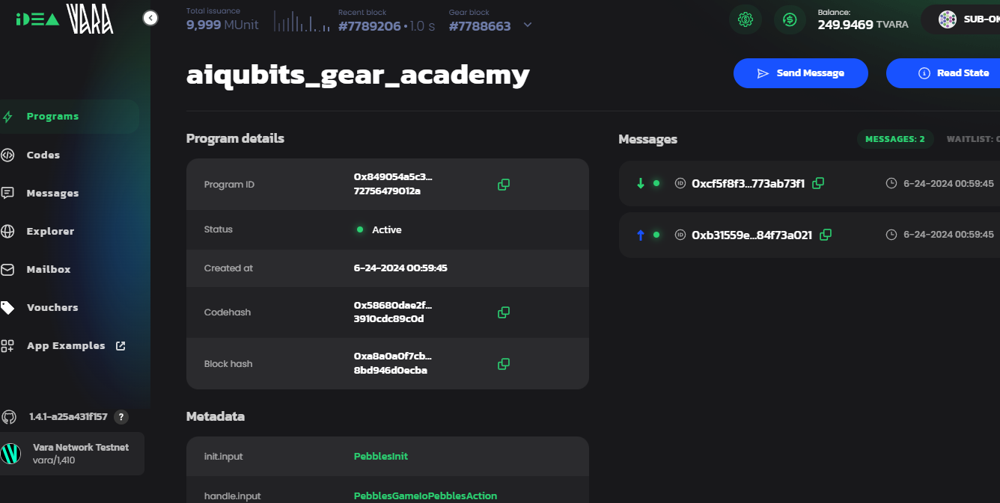

# Task Description

In this homework you are to write the Pebbles Game. The games rules are the following:

- There are two players: User and Program. The first player is chosen randomly.

- The game starts with N pebbles (e.g. N= 15).

- On the player's turn they must remove from 1 to K pebbles (e... if K= 2, then the plaver removes 1 or 2 pebbles per turn)

- The player who takes last pebble(s) is the winner.

# Project Structure

It is necessary to make two crates: `pebbles-game` for the program and `pebbles-game-io` for data structures.

The directory structure should be the following:

```md
pebbles-game
    ├── io
    │   ├── src
    │   │   └── lib.rs
    │   └── Cargo.toml
    ├── src
    │   └── lib.rs
    ├── tests
    │   └── basic.rs
    ├── Cargo.lock
    ├── Cargo.toml
    └── build.rs
```

# Types Definition

The `pebbles-game-io` will contains type definitions for input, output, and internal state data.

https://idea.gear-tech.io/programs/0x849054a5c3fa3dcce136ed3196634d1af055217df03324ba2a0a72756479012a?node=wss%3A%2F%2Ftestnet.vara.network


